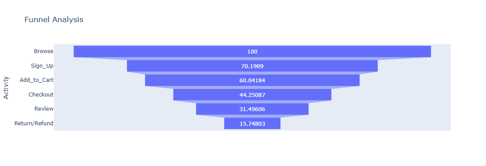

# 📊 Customer Funnel Analysis (SQL + Python)

## 📌 Overview
This project analyzes how customers move through an e-commerce funnel — from browsing to purchase completion. The goal is to identify drop-offs, understand user behavior, and improve conversion rates.

---

## 📷 Dashboard Preview


---

## 🎯 Objectives
- Track customer movement across funnel stages  
- Identify key drop-off points  
- Measure time between stages  
- Analyze conversion time  
- Compare performance across cities  

---

## 📊 Funnel Stages
- Browse  
- Sign Up  
- Add to Cart  
- Checkout  
- Review  
- Return/Refund  

---

## 📈 Key Insights
- Significant drop-off between **Sign Up → Add to Cart**  
- Early stages are faster than later stages  
- Funnel performance varies across cities  
- Drop-offs increase near final stages  

---

## 🛠 Tools & Technologies
- SQL  
- Python (Pandas, Matplotlib, Seaborn, Plotly)  

---

## 📂 Project Structure

```
customer-funnel-analysis/
│
├── Data/
├── images/
│   └── funnel.png
├── Python.ipynb
├── SQL.sql
└── README.md
```


---

## 🔍 Analysis
- Funnel creation from raw data  
- Transition time calculation  
- Drop-off identification  
- City-wise comparison  

---

## 📂 Dataset
Tables used:
- cust_activity.csv  
- cust_bio.csv  
- cust_sub.csv  
- orders.csv  
- subscription.csv  

Key fields:
- Cust_ID  
- Activity  
- Date  
- City  

---

## 🚀 How to Run
1. Run SQL queries from `/sql`  
2. Load dataset in Python  
3. Run Jupyter Notebook  

---

## 💡 Business Impact
- Improve conversion rates  
- Identify bottlenecks  
- Support data-driven decisions  

---

## 🙌 Conclusion
End-to-end funnel analysis using SQL and Python to generate actionable insights.

---
